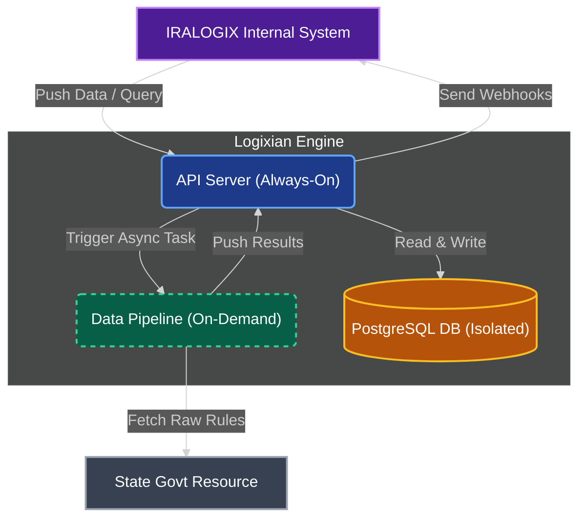
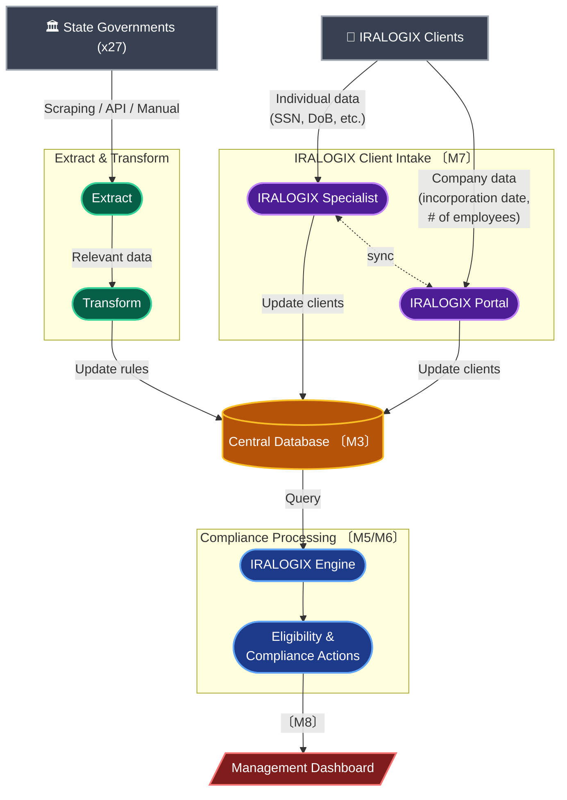
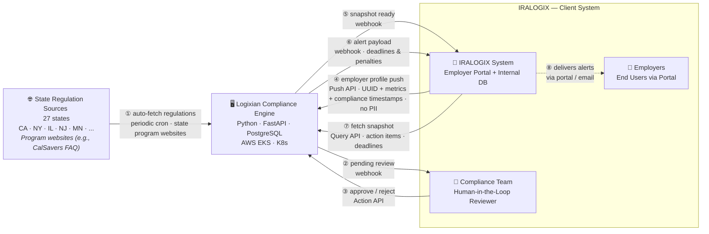

# Context Diagram (C4 Level 1)

> Shows the Logixian Compliance Engine in relation to external actors and systems. No internal implementation detail is shown here.

## Overview

High-level view of the three main components and how data flows between them.

## End-to-End Data Flow Diagram

> Traces data from state regulation sources and IRALOGIX clients through the ingestion pipeline into the central database, and out to the compliance engine and management dashboard.

## Key Components

| Component | Milestone | Description |
| --- | --- | --- |
| **Extract & Transform** | — | ETL pipeline ingesting regulations via scraping, API, or manual entry |
| **Client Intake** | M7 | IRALOGIX specialist and portal receiving individual and company data |
| **Central Database** | M3 | Single source of truth; updated by both ETL and client intake |
| **IRALOGIX Engine** | M5/M6 | Queries the database and triggers eligibility and compliance actions |
| **Management Dashboard** | M8 | Final output surface for compliance status and alerts |

## Diagram

## Detailed View

Full actor and interface breakdown showing all eight numbered communication flows.

## Actors

| Actor | Type | Description |
| --- | --- | --- |
| **State Regulation Sources** | External System | State government program websites (e.g., CalSavers FAQ pages) and structured documents. Initially CA, NY, IL, NJ, MN (5 states); expands to 27. Source type confirmed as program websites, not raw statutes (FR-I03). |
| **IRALOGIX System** | External System | Pre-existing employer portal and internal DB owned by the client. Logixian connects to it exclusively via API contracts and webhooks. |
| **IRALOGIX Compliance Team** | Human | Internal compliance staff who review and approve/reject detected regulation changes before they take effect. |
| **Employers** | Human (Indirect) | End clients subject to state-mandated retirement compliance. They interact via the IRALOGIX portal, never directly with Logixian. |

## Interface Summary

| # | Interface | Direction | Protocol | Trigger |
| --- | --- | --- | --- | --- |
| ① | Regulatory auto-fetch | LX → State Sources | HTTP/PDF scrape (state program websites) | Periodic cron |
| ② | Pending review notification | LX → Compliance Team | Webhook (HTTPS POST) | After ingestion detects changes |
| ③ | Approve / Reject action | Compliance Team → LX | REST Action API | Human decision |
| ④ | Employer profile push | IRALOGIX → LX | REST Push API (POST) | New employer or data change; payload includes compliance-relevant timestamps (registration_date, roster_upload_date, payroll_deduction_date) |
| ⑤ | Snapshot-ready notification | LX → IRALOGIX | Webhook (HTTPS POST) | After compliance calculation completes |
| ⑥ | Alert payload delivery | LX → IRALOGIX | Webhook (HTTPS POST) | Monitoring detects upcoming deadline |
| ⑦ | Compliance snapshot fetch | IRALOGIX → LX | REST Query API (GET) | After receiving webhook ⑤ |
| ⑧ | Employer-facing interaction | IRALOGIX → Employer | IRALOGIX-owned UI/email | Owned entirely by IRALOGIX |

## Key Boundaries & Assumptions

1. **Logixian is a black box** — IRALOGIX does not access Logixian's database directly. All communication is via versioned API contracts.
2. **No PII crosses the API boundary** — Only anonymized employer UUID + metrics are exchanged (GDPR compliance).
3. **Alerting ownership** — Logixian generates alert payloads only. IRALOGIX owns final delivery to employers (email, UI, SMS).
4. **Regulation source type** — Logixian fetches from state program websites (e.g., CalSavers FAQ), not raw statutes; the LLM parses program-formatted content.
5. **Human approval required** — No detected regulation change is applied to live compliance logic until approved by the IRALOGIX Compliance Team.

---

## Changelog (v1 → v2)

| Change | Section | Source | Rationale |
|--------|---------|--------|-----------|
| **Updated** — Actor description for "State Regulation Sources": changed from "State government websites and PDFs" to "State government program websites (e.g., CalSavers FAQ pages) and structured documents" | Actors | requirement_v7.md — FR-I03 update | Brad confirmed source type is program websites (e.g., CalSavers FAQ), not raw statutes; architecturally significant because it determines what the LLM must parse |
| **Updated** — Interface ① annotation: changed "weekly cron · ≤1 week latency" to "periodic cron · state program websites" | Interface Summary | requirement_v7.md — FR-I03 update | Ingestion frequency is operational configuration; source type annotation reflects confirmed program-website origin |
| **Updated** — Detailed View node label for SRS: added "Program websites (e.g., CalSavers FAQ)" sub-label | Detailed View | requirement_v7.md — FR-I03 update | Visually confirms the source type in the diagram itself |
| **Updated** — Interface ④ description: added "compliance-relevant timestamps (registration_date, roster_upload_date, payroll_deduction_date)" to payload note | Interface Summary | requirement_v7.md — FR-D02 update | Brad clarified compliance deadlines are time-window-based; system must know when each action occurred; these timestamps cross the API boundary in the employer profile push |
| **Updated** — Key Boundaries item 4: replaced "Regulation detection latency — ≤1-week latency" with confirmed source-type note | Key Boundaries | requirement_v7.md — FR-I03 update | Source type (program website) is a structural boundary assumption; latency is operational |

> [HUMAN REVIEW REQUIRED] — Verify all Mermaid diagrams render correctly and that
> changes align with the current architecture driver baseline before accepting this
> as the new version.

## References

- [Architecture Driver](../../architecture-driver/requirement_v7.md)
