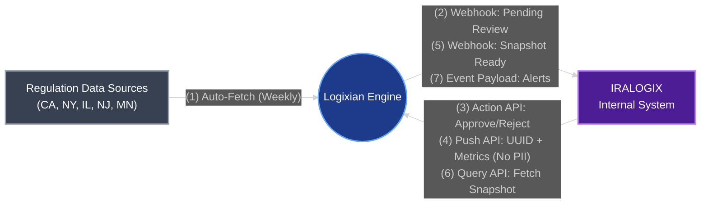
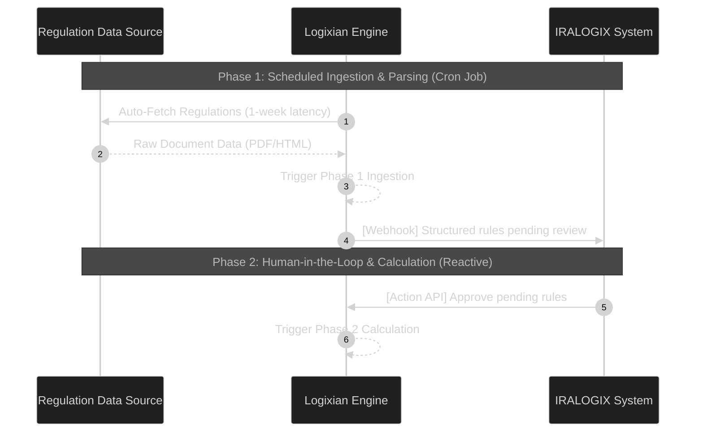
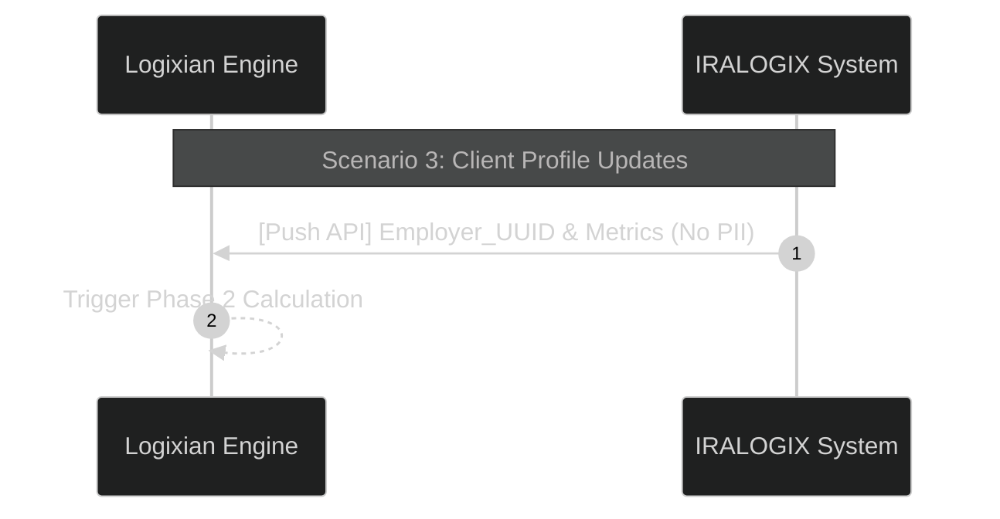
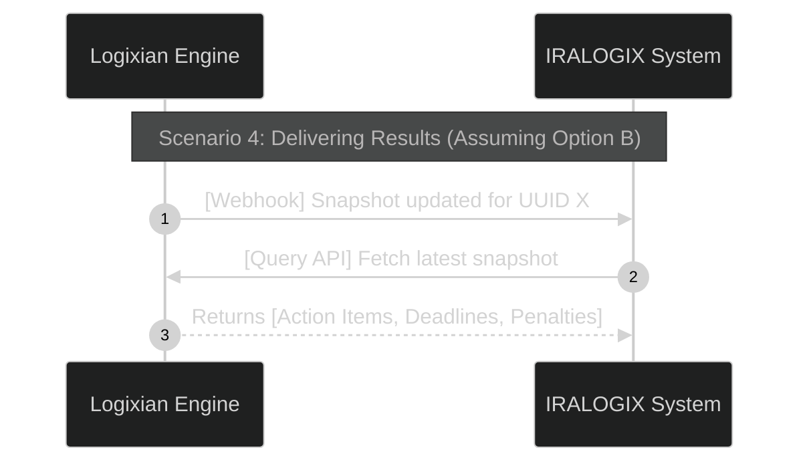
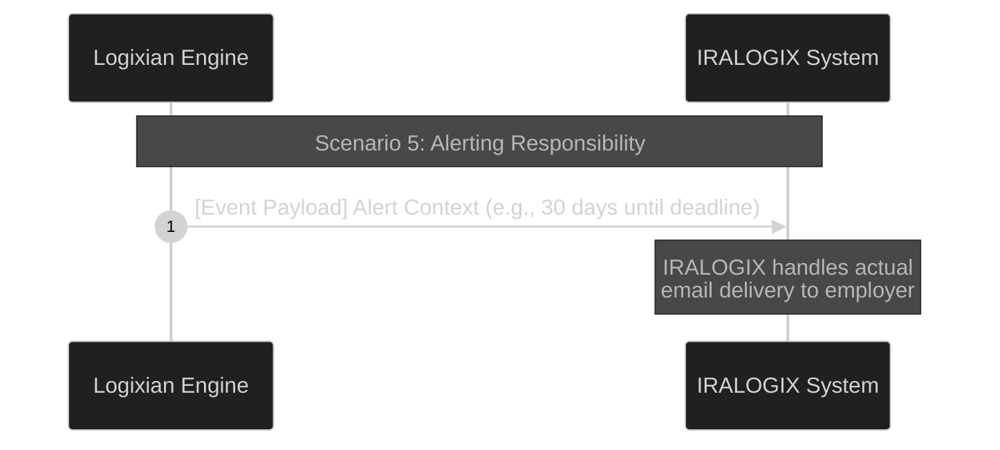
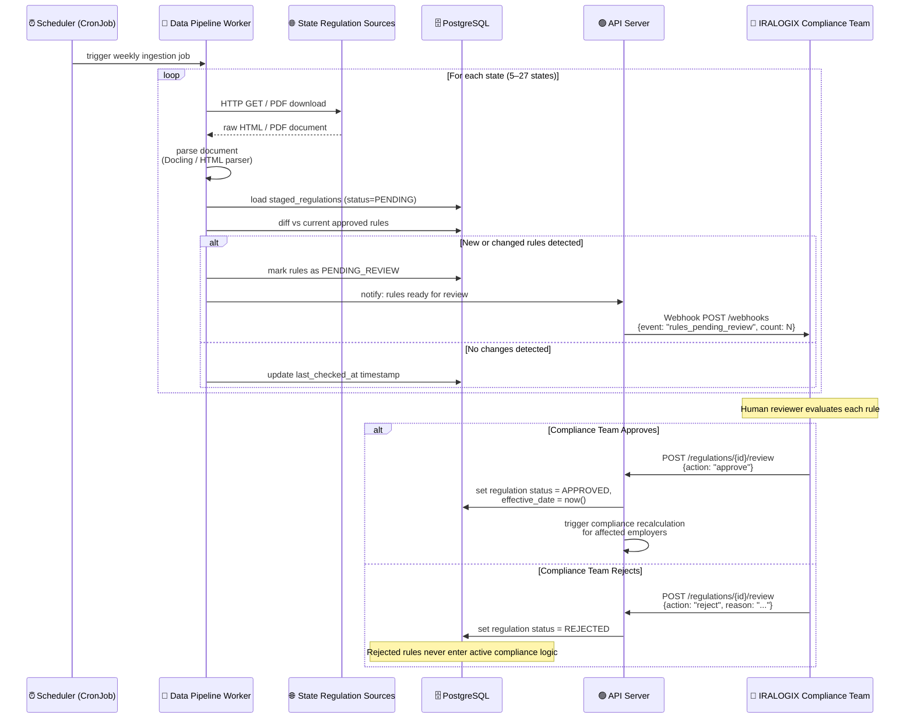
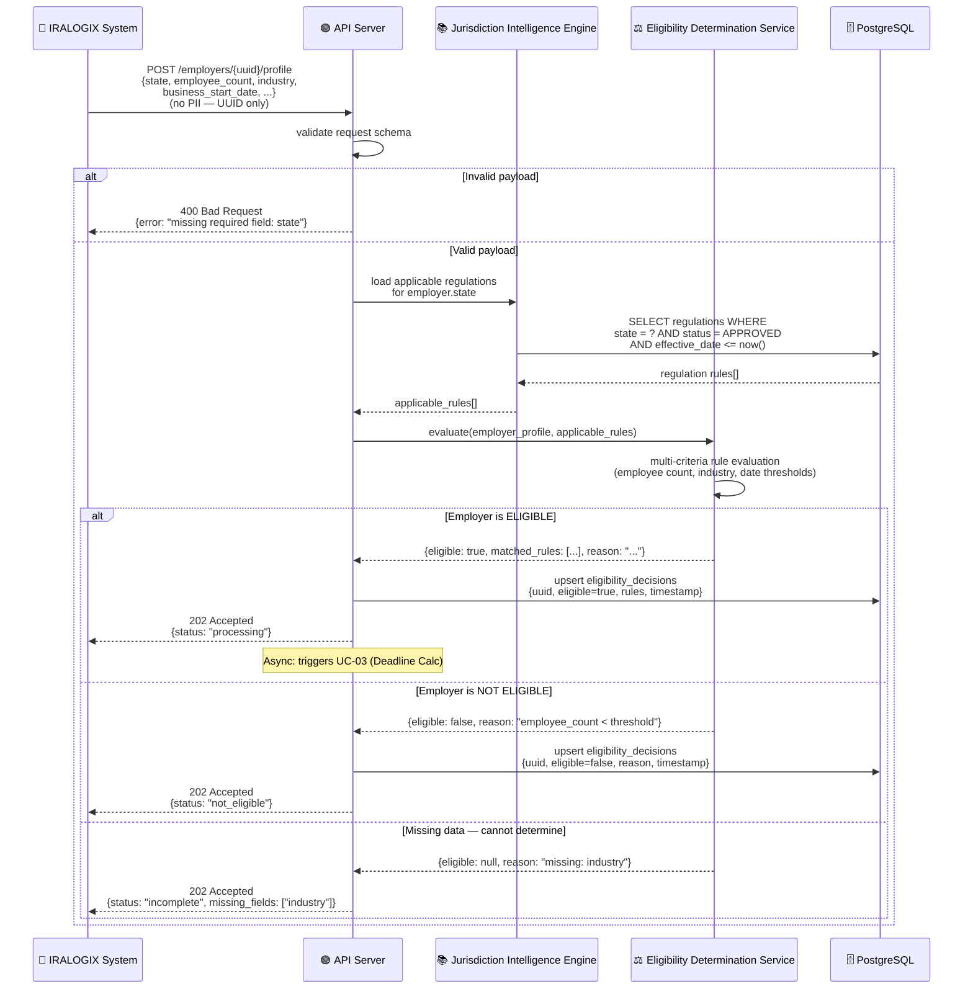
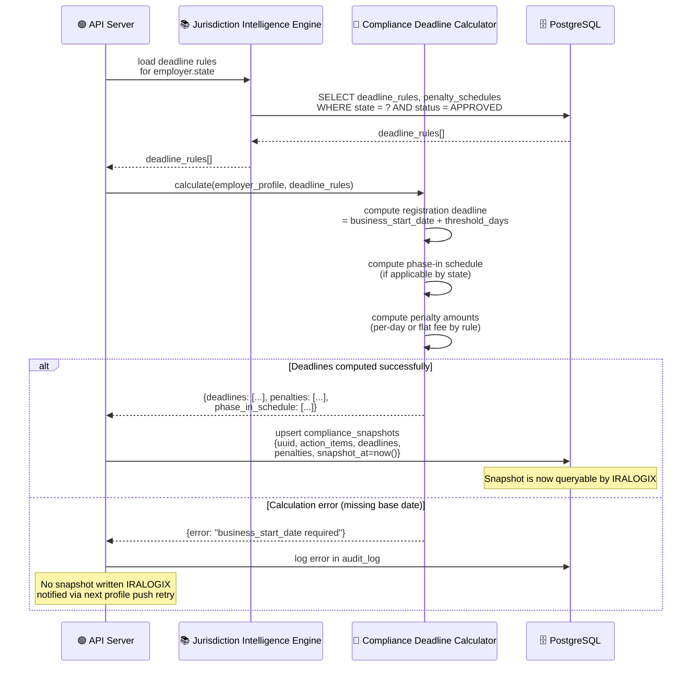
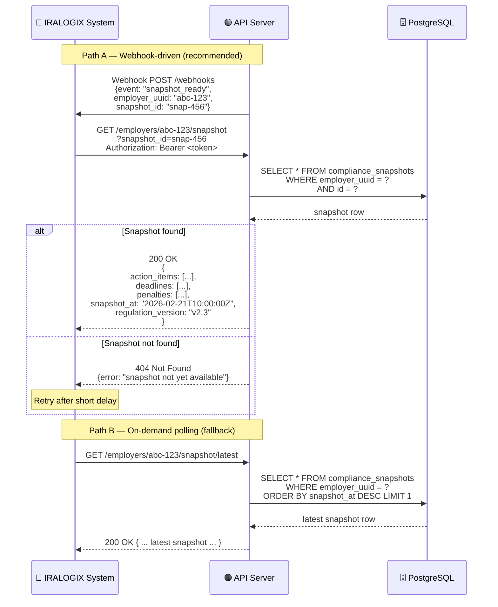
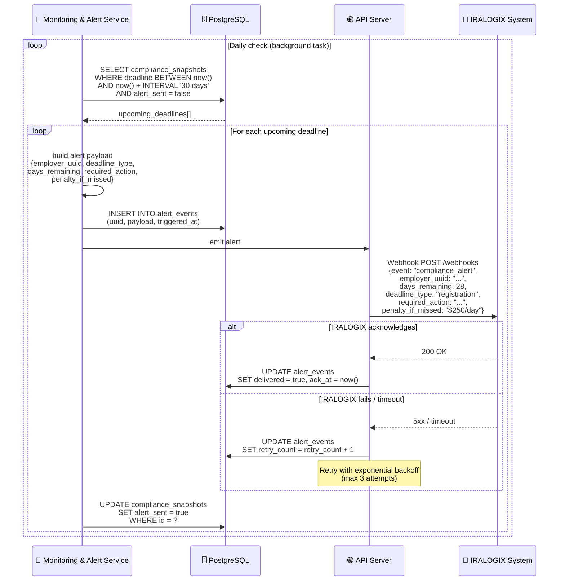

# Sequence diagram

## Part 1: High-Level Data Flow

## Part 2: Core Assumptions for Validation

### 1. The Two-Phase Data Pipeline

The Engine's heavy workloads are strictly decoupled into two phases to optimize performance and costs:

- **Phase 1 (Ingestion):** Runs on a weekly scheduled job to fetch and parse raw regulations into 'Pending' structured data.
- **Phase 2 (Calculation):** Is **strictly reactive**. Compliance calculations are only triggered when your team explicitly approves a rule or pushes an employer profile update.

### 2. Regulation Updates & The Unified Model

The system automatically tracks state regulations with a **1-week latency**. Detected changes require a 'Human-in-the-Loop' approval before taking effect.

- Proposed Interface
  - `[Logixian → IRALOGIX]` **Webhook:** "New regulation changes are pending your review."
  - `[IRALOGIX -> Logixian]` **Action API:** Approve or reject pending rules.
  - `[IRALOGIX -> Logixian]` **Query API:** Fetch details of active or pending regulations for your internal dashboard.

### 3. Client Data Boundary & Privacy

To comply with strict PII protection policies, the Engine will **NOT** store identifiable employer data. We will only store an "Anonymized Compliance Profile" using a reference UUID.

- **Proposed Interface:**
  - `[IRALOGIX -> Logixian]` **Push Employer Profile:** Sends `Employer_UUID`, and required metrics (e.g., `Employee_Count`). No names or contact info.

### 4. Delivering Results: Integration Pattern

When a calculation is finished, the Engine produces a "**Compliance Snapshot**" mapping the `Employer UUID` to their `[Action Items, Deadlines, Penalties]`.

- **Proposed Interface Options:**
  - **Option A (Polling):** `[IRALOGIX -> Logixian]` **Query API:** IRALOGIX periodically asks "Give me the latest snapshot for UUID X."
  - **Option B (Event-Driven):** `[Logixian -> IRALOGIX]` **Webhook:** "Snapshot updated for UUID X" → *followed by* → `[IRALOGIX -> Logixian]` **Query API** to fetch the exact details.

### 5. Alerting Responsibility

Our Engine determines ***when*** an alert is needed based on deadlines, but it will **not** send emails directly to end-employers.

- **Proposed Interface:**
  - `[Logixian -> IRALOGIX]` **Event Payload:** Sends the alert context (e.g., "UUID 1234: 30 days until deadline") to your existing notification service.

---

### Detail

## Sequence Diagrams — Use Cases

---

## UC-01: Regulatory Data Ingestion + Human-in-the-Loop Review

**Requirements covered:** FR-I01 (auto-track), FR-I02 (parse), FR-I03 (detect changes), FR-I04 (human-in-loop), FR-I05 (latency ≤1 week)  
**Trigger:** Weekly cron (Sunday 2AM)

---

## UC-02: Employer Profile Push & Eligibility Determination

**Requirements covered:** FR-D01 (evaluate employer), FR-D02 (store decision + reason)  
**Trigger:** IRALOGIX pushes employer data (new employer or profile change)

---

## UC-03: Compliance Deadline Calculation

**Requirements covered:** FR-C01 (calculate deadlines), FR-C02 (phase-in schedules), FR-C03 (penalties)  
**Trigger:** Fired automatically after UC-02 determines eligibility = true, OR after a regulation is approved in UC-01

---

## UC-04: Compliance Snapshot Retrieval

**Requirements covered:** FR-D01 (provide output: action items, deadlines, penalties)  
**Trigger:** IRALOGIX receives webhook ⑤ (snapshot-ready) OR polls on demand

---

## UC-05: Compliance Alerting (Payload Generation)

**Requirements covered:** FR-M01 (track compliance status), FR-M02 (send notifications)  
**Trigger:** Monitoring service detects an employer deadline is approaching (e.g., ≤30 / ≤7 days away)  
**Note:** Logixian generates the alert payload only. IRALOGIX owns final delivery (email/UI/SMS).

---

## References

- [Architecture Driver](../../architecture-driver/requirement_v1.md) — FR-I, FR-D, FR-C, FR-M requirement IDs referenced in each use case header
- [Context Diagram (C4 Level 1)](../00-context-diagram/context-diagram_v1.md) — System boundary, external actors, and the eight numbered interface flows that these sequences implement
