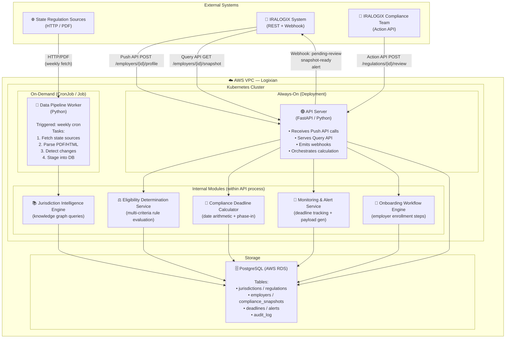
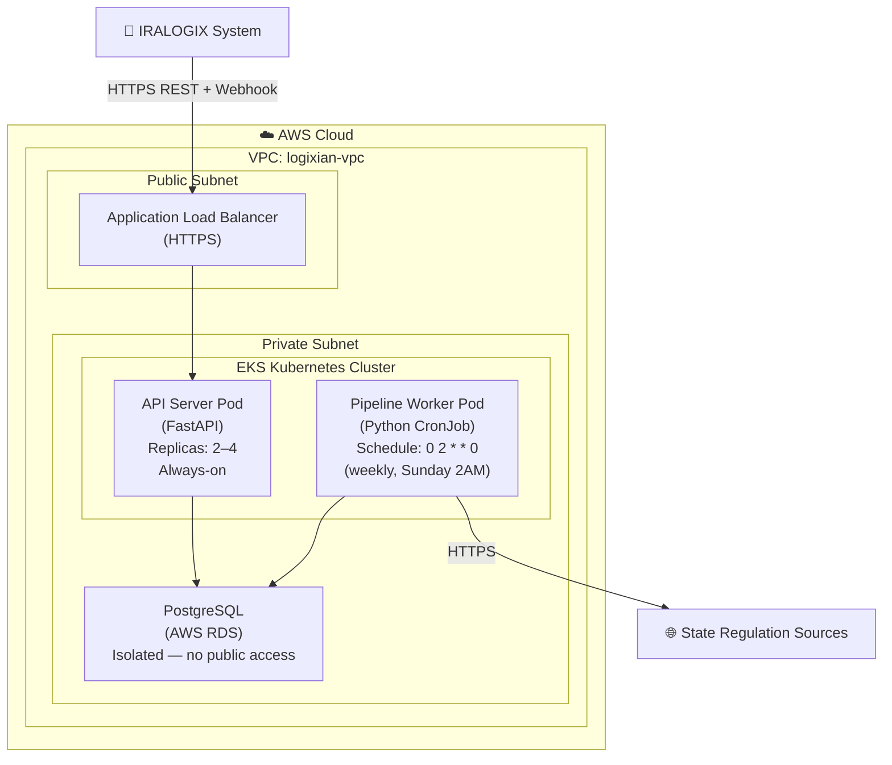

# Container Diagram (C4 Level 2)

> **C4 Level 2** — Shows the internal deployable containers (services, processes, databases) inside the Logixian Compliance Engine. External systems are shown at the boundary.

## 2.1 Component Topology

## 2.2 Deployment View

## Container Descriptions

| Container | Technology | Responsibility | Scaling |
|---|---|---|---|
| **API Server** | Python, FastAPI (async), K8s Deployment | External API surface, request routing, orchestrates calculation modules, emits webhooks | Horizontal: 2–4 replicas behind ALB |
| **Data Pipeline Worker** | Python, K8s CronJob | Weekly ingestion: fetch → parse → diff → stage regulations into PostgreSQL | On-demand, triggered by cron or manual |
| **Jurisdiction Intelligence Engine** | Python module (in-process) | Queries the knowledge graph for applicable rules per state/employer type | Shared with API Server process |
| **Eligibility Determination Service** | Python module (in-process) | Evaluates employer characteristics against loaded rules; returns eligibility + reason | Shared with API Server process |
| **Compliance Deadline Calculator** | Python module (in-process) | Computes deadlines, penalties, and phase-in schedules using effective-date logic | Shared with API Server process |
| **Monitoring & Alert Service** | Python module (in-process) | Tracks snapshot expiry and upcoming deadlines; generates alert payloads | Runs as background task or scheduled job |
| **Onboarding Workflow Engine** | Python module (in-process) | Manages employer onboarding step state machine | Shared with API Server process |
| **PostgreSQL (AWS RDS)** | PostgreSQL 15, AWS RDS | Single source of truth: regulations, compliance snapshots, deadlines, audit log | Vertical scale + read replicas as needed |

## References

- [Context Diagram (C4 Level 1)](../00-context-diagram/context-diagram_v1.md)
- [Sequence Diagram](../01-sequence-diagram/sequence-diagram_v1.md)
