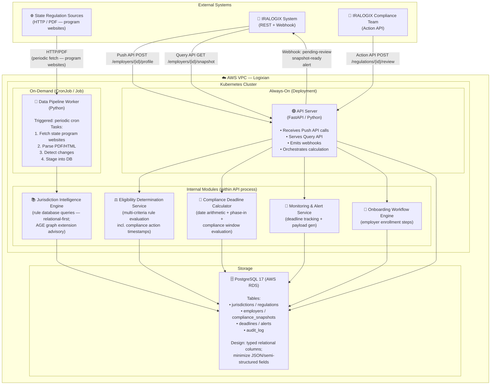
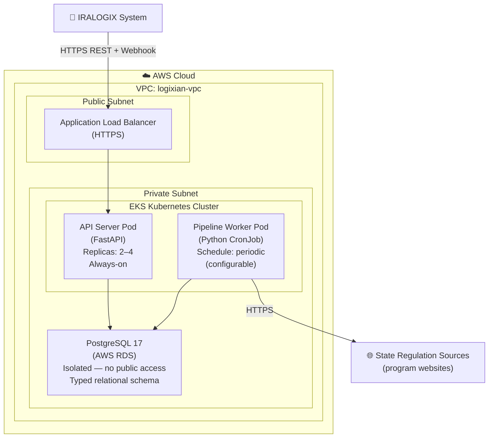

# Container Diagram (C4 Level 2)

> **C4 Level 2** — Shows the internal deployable containers (services, processes, databases) inside the Logixian Compliance Engine. External systems are shown at the boundary.

## 2.1 Component Topology

## 2.2 Deployment View

## Container Descriptions

| Container | Technology | Responsibility | Scaling |
|---|---|---|---|
| **API Server** | Python, FastAPI (async), K8s Deployment | External API surface, request routing, orchestrates calculation modules, emits webhooks | Horizontal: 2–4 replicas behind ALB |
| **Data Pipeline Worker** | Python, K8s CronJob | Periodic ingestion: fetch state program websites → parse → diff → stage regulations into PostgreSQL | On-demand, triggered by cron or manual |
| **Jurisdiction Intelligence Engine** | Python module (in-process) | Queries the rules database for applicable regulations per state/employer type; relational-first approach (Apache AGE graph extension remains available but is advisory — adopted only if graph traversal is required after data model is finalized) | Shared with API Server process |
| **Eligibility Determination Service** | Python module (in-process) | Evaluates employer characteristics and compliance action timestamps against loaded rules; returns eligibility + reason. Logixian itself constitutes the Business Rules Engine — no external BRE (OPA, Drools) adopted | Shared with API Server process |
| **Compliance Deadline Calculator** | Python module (in-process) | Computes deadlines, penalties, and phase-in schedules using effective-date logic; evaluates compliance windows using `registration_date`, `roster_upload_date`, `payroll_deduction_date` timestamps | Shared with API Server process |
| **Monitoring & Alert Service** | Python module (in-process) | Tracks snapshot expiry and upcoming deadlines; generates alert payloads | Runs as background task or scheduled job |
| **Onboarding Workflow Engine** | Python module (in-process) | Manages employer onboarding step state machine | Shared with API Server process |
| **PostgreSQL 17 (AWS RDS)** | PostgreSQL 17, AWS RDS | Single source of truth: regulations, compliance snapshots, deadlines, audit log. Schema uses typed relational columns; JSON/semi-structured columns minimized for indexability and schema clarity | Vertical scale + read replicas as needed |

## References

- [Context Diagram (C4 Level 1)](../00-context-diagram/context-diagram_v2.md)
- [Sequence Diagram](../01-sequence-diagram/sequence-diagram_v2.md)

---

## Changelog (v1 → v2)

| Change | Section | Source | Rationale |
|--------|---------|--------|-----------|
| **Updated** — SRS node label: added "(program websites)" annotation | 2.1 Component Topology | requirement_v7.md — FR-I03 update | Source type is confirmed as program websites; architecturally significant for the pipeline's parsing strategy |
| **Updated** — WORKER module task list: changed "Fetch state sources" to "Fetch state program websites" | 2.1 Component Topology | requirement_v7.md — FR-I03 update | Aligns Worker description with confirmed source type |
| **Updated** — WORKER schedule annotation: changed "weekly cron" to "periodic cron (configurable)" | 2.1 / 2.2 | requirement_v7.md — FR-I02 (v6 baseline) | Ingestion frequency is operational configuration, not a fixed architectural constraint |
| **Updated** — JIE module description: changed "knowledge graph queries" to "rule database queries — relational-first; AGE graph extension advisory" | 2.1 Component Topology | requirement_v7.md — Technical Constraint (PostgreSQL AGE advisory) | Brad indicated AGE may not be needed given the relational data model; making it advisory avoids premature adoption |
| **Updated** — JIE container description: full description updated to reflect relational-first approach and advisory AGE status | Container Descriptions | requirement_v7.md — Technical Constraint (PostgreSQL AGE advisory) | Same rationale; JIE description in v1 said "knowledge graph queries" which implied mandated graph use |
| **Updated** — EDS container description: added note that Logixian itself constitutes the BRE; no external BRE adopted | Container Descriptions | requirement_v7.md — Technical Constraint (BRE resolved) | Brad explicitly resolved the open BRE decision: data model + rule enforcement code IS the BRE; no OPA/Drools |
| **Updated** — EDS module description: added "compliance action timestamps" to evaluation inputs | 2.1 Component Topology | requirement_v7.md — FR-D02 update | Eligibility evaluation must factor in when compliance actions occurred |
| **Updated** — CDC module description: added "compliance window evaluation" and timestamp field references | 2.1 Component Topology | requirement_v7.md — FR-D02 update | Deadline calculation must compare action timestamps against phase-in schedules |
| **Updated** — CDC container description: added timestamp fields used in compliance window evaluation | Container Descriptions | requirement_v7.md — FR-D02 update | Same rationale as CDC module update |
| **Updated** — PostgreSQL node label: changed "PostgreSQL (AWS RDS)" to "PostgreSQL 17 (AWS RDS)"; added typed relational schema note | 2.1 / 2.2 | requirement_v7.md — Technical Constraint (PostgreSQL 17 + data model column design) | v1 label showed "PostgreSQL 15" inconsistent with requirement baseline; v7 adds explicit typed-column constraint |
| **Updated** — PostgreSQL container description: added column design constraint (typed relational columns; minimize JSON) | Container Descriptions | requirement_v7.md — Technical Constraint (data model column design) | Brad explicitly constrained data model: JSON columns create indexing and schema-clarity problems at scale |
| **Updated** — Deployment View WORKER schedule annotation: changed "0 2 * * 0" to "periodic (configurable)" | 2.2 Deployment View | requirement_v7.md — FR-I02 (v6 baseline) | Fixed schedule is operational configuration, not architectural constraint |
| **Updated** — References: point to v2 context and sequence diagrams | References | version alignment | Keep cross-diagram references consistent |

> [HUMAN REVIEW REQUIRED] — Verify all Mermaid diagrams render correctly and that
> changes align with the current architecture driver baseline before accepting this
> as the new version.

## References

- [Architecture Driver](../../architecture-driver/requirement_v7.md)
