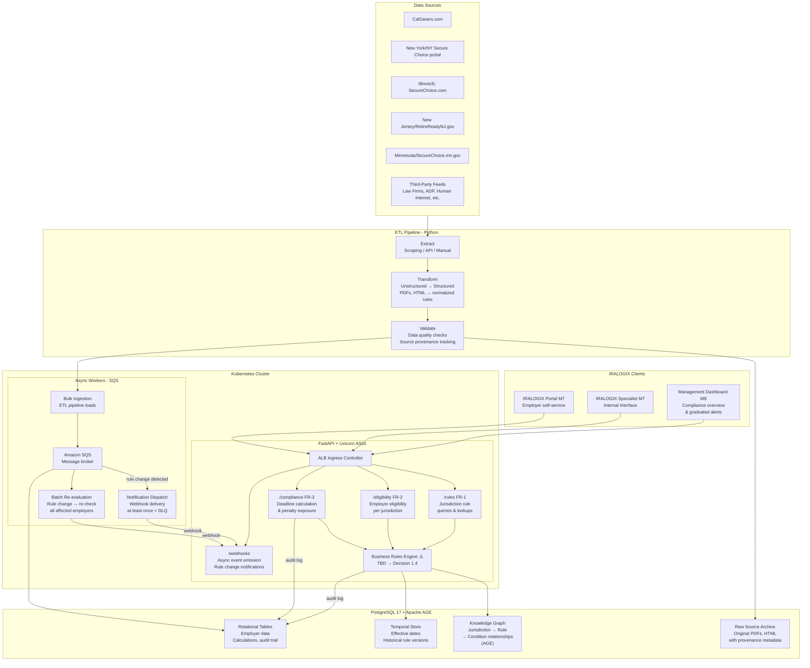

```mermaid
flowchart TD

  %% Data Sources
  subgraph DS["Data Sources"]
    CA[CalSavers.com]
    NY[New York/NY Secure Choice portal]
    IL[Illinois/IL SecureChoice.com]
    NJ[New Jersey/RetireReadyNJ.gov]
    MN[Minnesota/SecureChoice.mn.gov]
    TP[Third-Party Feeds\nLaw Firms, ADP, Human Interest, etc.]
  end

  %% ETL Pipeline
  subgraph ETL["ETL Pipeline - Python"]
    EXT["Extract\nScraping / API / Manual"]
    TRF["Transform\nUnstructured → Structured\nPDFs, HTML → normalized rules"]
    VAL["Validate\nData quality checks\nSource provenance tracking"]
    EXT --> TRF --> VAL
  end

  DS --> EXT

  %% Kubernetes Cluster
  subgraph K8S["Kubernetes Cluster"]

    subgraph ASYNC["Async Workers - SQS"]
      BULK["Bulk Ingestion\nETL pipeline loads"]
      SQS["Amazon SQS\nMessage broker"]
      NOTIF["Notification Dispatch\nWebhook delivery\nat-least-once + DLQ"]
      BATCH["Batch Re-evaluation\nRule change → re-check\nall affected employers"]
      BULK --> SQS
      SQS --"rule change detected"--> NOTIF
      SQS --> BATCH
    end

    subgraph API["FastAPI + Uvicorn ASGI"]
      ALB["ALB Ingress Controller"]
      R1["/rules FR-1\nJurisdiction rule\nqueries & lookups"]
      R2["/eligibility FR-2\nEmployer eligibility\nper jurisdiction"]
      R3["/compliance FR-3\nDeadline calculation\n& penalty exposure"]
      WH["/webhooks\nAsync event emission\nRule change notifications"]
      BRE["Business Rules Engine ⚠️\nTBD → Decision 1.4"]
      ALB --> R1
      ALB --> R2
      ALB --> R3
      ALB --> WH
      R1 & R2 & R3 --> BRE
    end

  end

  VAL --> BULK
  NOTIF --"webhook"--> WH
  BATCH --"webhook"--> WH
  BRE --"audit log"--> DB_REL
  R3 --"audit log"--> DB_REL

  %% IRALOGIX Clients
  subgraph CLIENTS["IRALOGIX Clients"]
    MGMT["Management Dashboard M8\nCompliance overview\n& graduated alerts"]
    SPEC["IRALOGIX Specialist M7\nInternal interface"]
    PORT["IRALOGIX Portal M7\nEmployer self-service"]
  end

  MGMT --> ALB
  SPEC --> ALB
  PORT --> ALB

  %% Data Store
  subgraph DB["PostgreSQL 17 + Apache AGE"]
    DB_TS["Temporal Store\nEffective dates\nHistorical rule versions"]
    DB_REL["Relational Tables\nEmployer data\nCalculations, audit trail"]
    DB_KG["Knowledge Graph\nJurisdiction → Rule\n→ Condition relationships\n(AGE)"]
    DB_RAW["Raw Source Archive\nOriginal PDFs, HTML\nwith provenance metadata"]
  end

  VAL --> DB_RAW
  SQS --> DB_REL
  BRE --> DB_KG
  BRE --> DB_TS
```