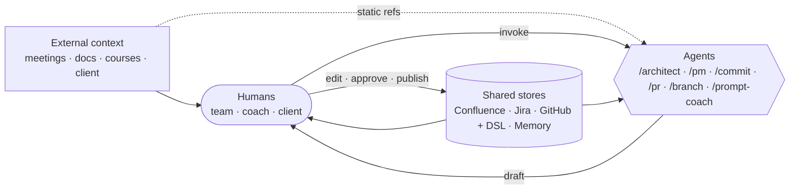
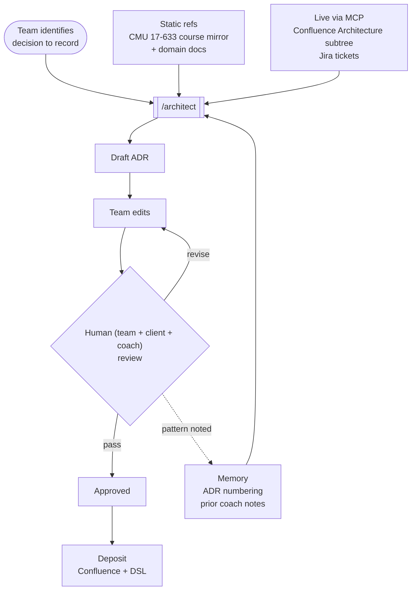
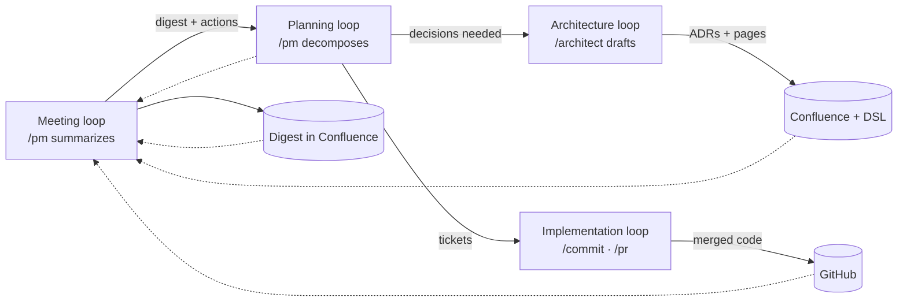

# Logixian as a Context Machine

*For the coaching session with Christian Kästner. 2026-04-23 draft.*

*Companion to `software-engineering-system.md` (Scott-framework view). Same system, different lens: angled at ML-in-production concerns rather than SE metamodel.*

---

## Framing

What we built is not "LLMs writing our code." It is an engineered pipeline for moving **context** around the team, with agents deployed as narrow, bounded processors at specific decision points.

Three claims we want Christian to push on:

1. **Context is the product, not the model.** What makes `/architect` useful is not Claude's base capability. It is the curated bundle of project docs, Confluence tree, ADR templates, and course summaries that get loaded on every invocation. Swap the LLM; the skill still carries the same method.
2. **Humans are first-class nodes, not reviewers at the edge.** Agents produce drafts. Humans gate, edit, and feed the result back into context. Every loop closes through a human.
3. **The failure modes are ML-systems failure modes.** Drift, staleness, silent regression, evaluation gaps, reviewer fatigue. We have a few mitigations, several blind spots, and we want Christian's help spotting the ones we are not seeing.

---

## 1. What counts as context

The agent sees four stacked context sources on every invocation:

| Source | Form | Updated by | Freshness model |
|---|---|---|---|
| Static files in repo | `CLAUDE.md`, skill `SKILL.md`, `ref/` materials (full CMU 17-633 course mirror) | Team commits | Git-versioned, manual refresh |
| Dynamic lookups | MCP calls to Confluence, Jira, GitHub | Live at invocation | Always fresh (subject to API availability) |
| Persistent memory | `~/.claude/projects/.../memory/` per-user facts | Conversations update | Accumulates; pruning is manual |
| Conversation history | In-session | The session itself | Lost at session end unless memorialized |

The first two are team-shared. The last two are per-user.

## 2. Context routing per skill

Each team skill is a context-routing spec. It declares what to load and what method to apply to the loaded content.

| Skill | Static load | Dynamic load (MCP) | Memory touched | Output format |
|---|---|---|---|---|
| `/architect` | Full CMU 17-633 course mirror (26 lectures + Nygard reading), static domain docs | Confluence `3. Architecture` tree, Jira IRA-NN tickets | ADR numbering state, coach-feedback notes | ADR draft (Nygard template), Confluence page, Structurizr DSL |
| `/pm` | Digest template, sprint ceremony structure, risk-register conventions | Jira board, Confluence weekly meeting pages | Team roster, sprint calendar | Weekly digest, Jira ticket updates |
| `/commit`, `/pr`, `/branch` | Conventional-commit spec, project commit style | git state, Jira for branch names | Last-used conventions | Commit messages, PR text, branch names |
| `/prompt-coach` | English grammar + engineering writing conventions | — | User writing preferences | Prompt rewrites |

The bet: by fixing the context bundle per skill, the output quality is bounded more by context quality than by model drift over time.

## 3. The loops (through a context lens)

Four processes in which context cycles. Each described by what context enters, what gets transformed, and what context the cycle deposits back.

### Meeting → Digest
- **Enters**: raw Zoom transcripts, Confluence meeting pages, prior digests (context for style).
- **Transforms**: `/pm` aggregates and summarizes; human edits.
- **Deposits**: weekly digest in Confluence; action items in Jira; updated context for next loop iteration.

### Planning → Backlog
- **Enters**: digest action items, milestone plan, current sprint state.
- **Transforms**: `/pm` decomposes scope into tickets using a predefined format; human assigns owners.
- **Deposits**: sprint backlog in Jira; next weekly digest picks up the new tickets.

### Decision → ADR / Page
- **Enters**: static method knowledge (full CMU 17-633 course mirror), static domain docs, live Confluence tree, related ADRs.
- **Transforms**: `/architect` drafts; human edits; coach/client review.
- **Deposits**: approved ADR in Confluence; updated architecture index; memory note if coach flagged a pattern to change.

### Ticket → PR (summer, designed today)
- **Enters**: ticket spec with acceptance criteria, code repo state, project commit conventions.
- **Transforms**: developer with LLM assist implements; `/commit` and `/pr` format the deliverables.
- **Deposits**: merged code; updated repo state; ticket transitioned in Jira.

Each deposit becomes context input for a later loop. The machine's health is whether this cycling converges or diverges.

## 4. Context integrity concerns

Where the system can silently fail:

| Concern | Current state | Mitigation today | Gap |
|---|---|---|---|
| Static context drift (skill's `ref/` goes stale relative to Confluence) | Real. E.g., `/architect` pinning old ADR numbering if Confluence changes ordering | Manual refresh on noticing | No version stamp or automated check |
| MCP lookup returning stale or partial data | Possible; we have not seen it in practice | None | No validation on MCP responses |
| Memory accumulation bias (stale preferences baked in) | Real. Memory grows without pruning | Manual pruning when noticed | No scheduled audit |
| Skill prompt regression (SKILL.md edit breaks downstream output) | Real, low-frequency so far | Commit review before merge | No golden-set test for skills |
| Human review fatigue (rubber-stamping AI output) | Real risk as volume grows | Sprint 7 retro policy: no paste-through | No measurement yet |
| Reviewer context gap (reviewer lacks context the AI had) | Real. Reviewer sees the draft, not the prompt that produced it | Prompt-preservation convention (under discussion) | Not enforced |

## 5. Feedback loops

What teaches the system to improve:

1. **Coach feedback** (weekly session) → skill `SKILL.md` or `ref/` edits → next invocation produces different output.
2. **Human rejection** of an AI draft → memory update ("user prefers X for Y") → future drafts incorporate.
3. **Sprint retro** → process policy change (e.g., no-paste-through rule) → codified in CLAUDE.md.
4. **Client review** → requirement clarifications → Confluence update → next architecture loop picks up the new context.

Concrete closed-loop example from the last week:
- Coach (2026-04-17): ADRs are LLM-long and missing explicit trade-off rationale.
- Team decision (2026-04-22): `/architect` should enforce per-consequence "trade-off accepted" lines.
- Implementation (TBD before crit): update SKILL.md to require the line.
- Observation loop closes when ADR-003 is revised in this style and coach confirms.

The loop closes in roughly one week. That is both our best feature and our slowest process. We have no faster feedback surface.

## 6. What we lack

1. **Systematic evaluation of agent output.** We only measure human rejection at a coarse level. No golden-set, no regression suite, no A/B test. For `/architect` in particular, output is high-stakes and low-volume, which makes traditional eval hard.
2. **Skill versioning semantics.** Skills are git-tracked markdown, but we have no "skill v1.2 deprecates v1.1" discipline. We do not know how to roll back a bad change beyond `git revert`.
3. **Prompt-preservation for review auditability.** When a reviewer gets an AI draft, they cannot see the exact context the AI had. They judge output, not input.
4. **Cost and latency instrumentation.** No tracking of tokens, cost, or time per skill invocation. We do not know whether the agent is economical or wasteful.
5. **Drift detection on static context.** When a Confluence page changes, skills referencing it do not know. No invalidation mechanism.
6. **Context-scope test for skills.** Before shipping a skill to the team, what minimal test proves it reads the right sources and produces acceptable output? We have none.
7. **Exploratory vs generative telemetry.** Exploratory use (brainstorming, what-if, trade-off exploration) and generative use (drafting a usable artifact) have different success criteria. We conflate them in practice and measure neither.

## 7. Questions

In rough priority:

1. **Evaluation for low-volume, high-stakes agent output.** Is there a pattern for this other than human review? Our `/architect` produces maybe two or three ADRs per sprint. Traditional accuracy metrics do not apply.
2. **Versioning and rollback.** What is the minimal-viable versioning story for a markdown-based skill that gets invoked manually by the team? Would you treat them like model artifacts (immutable, versioned, deployed) or like source code (edited in place, trusted)?
3. **Drift detection.** How would you instrument "the context a skill loads has changed"? Is it worth it at our scale?
4. **When does a skill graduate to a service?** We currently run all agents interactively through Claude Code. At what point does it make sense to extract them into standalone automation?
5. **Measurement priorities.** Given we cannot instrument everything, which two or three metrics would you stand up first?
6. **Human-in-the-loop review fatigue.** What have you seen work in ML production when the human in the loop starts rubber-stamping?

## 8. What we are not asking about

Deliberately out of scope for Christian's session:

- LLM-1 and LLM-2 inside the Logixian product runtime. Those are software-quality concerns, covered by our Quality Management work, and belong with a different coach.
- Model selection (Claude vs GPT vs local). We have chosen Claude for now; not seeking a technology comparison.
- General Claude Code tooling features. We are interested in the engineering system, not the IDE.

---

## Appendix: diagrams

### A. Machine overview

Four major actors and the cycle between them. Every agent invocation reads from stores and external context, produces a draft to humans, humans gate and deposit into stores, and the next invocation sees the updated state.

### B. One loop in detail: Architecture

A representative loop showing context loaded per invocation, the transformation, the human gate, the deposit, and the feedback channel. Meeting, Planning, and Implementation loops follow the same shape with different context bundles.

### C. How the four loops compose

The loops feed each other. Meeting outputs drive Planning. Planning outputs drive Architecture and Implementation. Implementation outputs surface in next Meeting. The machine's health is whether this cycling converges (decisions stable, velocity steady) or diverges (rework, stale decisions, ticket debt).

Edges labelled as `human`, `agent`, or `human-supervised agent` in a richer version. The third category is where most of the interesting engineering lives and the biggest source of risk.
