# Logixian Software Engineering System

*Draft v0.1 — 2026-04-23. Local working copy before Confluence.*

---

## Thesis

The Logixian engineering system is a context-flow machine. Raw inputs (meetings, requirements, coach feedback, course material) enter shared stores. Work products (ADRs, digests, PRs, diagrams) flow out. At specific points in that flow we deploy agents carrying both project context and structural knowledge. Agents inject method into the work, not just speed. Humans own every decision at every gate.

Evidence of this being deliberate, not emergent: the team's custom skill repo, CLAUDE.md hierarchy, persistent memory, and the weekly-digest loop each sit at a chosen point in the flow and enforce a specific method.

---

## 1. Project Characterization

| Factor | Value | Implication for the engineering system |
|---|---|---|
| Domain complexity | HIGH — regulatory, 20+ U.S. states, evolving rules | Strong need for human review gates on AI parsing output |
| Quality criticality | HIGH — clients face $250 to $750 per-employee penalties | Mandatory approval step before any compliance output reaches production |
| Codebase | Greenfield; Python + FastAPI, PostgreSQL, AWS EKS | No legacy constraints; can adopt LLM-first workflows from day one |
| Team | 5 MSE students, 12 hrs/week during semester, 36 hrs/week over summer | Skills must be shared via git; no single-owner lock-in |
| Client | Brad Campbell (IRALOGIX). Technical; weekly review cadence | Decisions flow through Confluence; client participates as chief architect |
| Timeline | Design (Feb to May 2026). Implementation (summer). Handoff (Dec 2026) | SE system must evolve from design-heavy to implementation-heavy |
| Constraints | Python + FastAPI, AWS, Auth0, KEDA, PostgreSQL. AWS cost-sensitive | Narrow technology decision space; focus on method over tooling |

---

## 2. Artifact Layer

### 2.1 Core artifacts (what the engineering system produces)

| Artifact type | Current home | LLM contribution | Human validation |
|---|---|---|---|
| Requirements (QAS, FR, constraints) | Confluence § 2 | Elicitation, ambiguity flag | Team walkthrough, client review |
| Architecture (views, ADRs) | Confluence § 3, Structurizr DSL | Draft, pattern suggestion, trade-off analysis | Team walkthrough, coach, client |
| API contract | OpenAPI YAML (IRA-89) | Schema drafting, example generation | Peer review |
| Data model | Confluence § 2.2 | Schema drafting, gap flagging | Domain walkthrough with client |
| Code (summer) | GitHub repos | Generation, refactoring, test scaffolding | PR review, CI, tests |
| Tests (summer) | GitHub repos | Test case and edge case generation | Coverage review, test review |
| Runbooks and docs | Confluence | Generation from code | Technical accuracy review |
| Meeting and coach summaries | Confluence | Summarization | PM edit before publishing |
| Weekly digest | Confluence | Aggregation from summaries | PM review before publishing |

### 2.2 Supporting artifacts (what enables LLM-aided work)

| Artifact | Location | Purpose |
|---|---|---|
| Skills (prompts as versioned code) | `logixian-agents/.claude/skills/` | Structural knowledge + project context packaged per role |
| CLAUDE.md hierarchy | Global, project, skill-local | Layered context that every Claude session loads |
| Memory store | `~/.claude/projects/.../memory/` | Persistent facts across sessions |
| Chat logs | `~/.claude/projects/` | Audit trail and debugging |
| Static reference materials | `logixian-agents/docs/`, skill `ref/` folders | Domain briefs, course summaries, templates |

### 2.3 Artifact lifecycle states

| State | Meaning | Who can create | Who can advance |
|---|---|---|---|
| Draft | Initial (often LLM-generated) | LLM or human | Any team member proposes review |
| Under Review | Human validation in progress | Human | Reviewer |
| Approved | Validated, ready to use | Human only | Coach or client (for major artifacts) |
| Published | Public in Confluence or git main | Reviewer | — |
| Superseded | Replaced by a newer version | — | Author of replacement |

Not every artifact runs through every state. Weekly digests skip Approved (the PM publish IS the approval). ADRs and architecture pages use all states.

### 2.4 Where artifacts live (Confluence information architecture)

The sections below are the **active structure** of the Team Logixian Internal Confluence space. Any page or folder outside this list is inactive and should not be treated as current. Outdated or legacy folders (for example, older SE system content) are ignored here on purpose.

Top-level folders are unnumbered in Confluence. Sub-pages inside each section carry their own numbering.

| Path | Purpose | Owner | Status | Notes |
|---|---|---|---|---|
| Meetings | Summaries, transcripts, Google Drive video links; organized by meeting category (client, internal, arch coach, QM coach, construction coach, mentor) | PM logs, attendee summarizes | Active | Every meeting lands here. `/pm` assists summarization |
| Team Practice | Team charter and norms | Team lead | Stale; only Team Charter is active and overdue for refresh | Refresh Team Charter before May 1 |
| **IRALOGIX Core** (product) | Working knowledge base for the product being built | Split per sub-section | Mixed | See sub-sections below |
| — 1. Project Context | Project overview, goals, scope, stakeholders | Team | Active | Small updates as scope clarifies |
| — 2. Requirements | QAS, data model, integration strategy, system boundaries | Jay | Mixed — QAS and data model active; initial boundary diagram stale | Mark or remove the stale initial boundary diagram |
| — 3. Architecture | Architecture main + API Server + Pipeline Worker + ADR folder + AWS Cost + Integration Guide. Older drafts archived to "Architecture Draft History" | Kuan + Puniveng | Active (consolidated 2026-04-22) | ADR-003 rationale refresh pending |
| — 4. Project Plan to End of Year | WBS and milestone tracking | PM (Kuan) | Weak; planning has lagged; Milestone 2 close to wrap | Refresh with Milestone 2 closure and summer-to-December plan |
| — 5. Key Risks and Mitigation | Risk register | PM (Kuan) | Thin; 2 risks logged | Expand to 5-7 entries including LLM-specific risks |
| — 6. Resources to Implement the Plan | Project delivery resources | PM (Kuan) | Placeholder | Populate with team roster and external resources |
| **Software Engineering System** (practice) | Engineering practice, processes, resources, measurements | Kuan | Mixed (structure in place, content drafting) | Section created 2026-04-24 during reorg |
| — 1. Overview | Thesis + metamodel + evidence | Kuan | Skeleton | Draft in `docs/software-engineering-system.md` |
| — 2. Processes | Four loops in ETVX form | Kuan | Skeleton | Source §3 in working draft |
| — 3. Resources | Skills, tools, humans, information architecture | Kuan | Skeleton | Source §4 and §2.4 in working draft |
| — 4. Measurement Plan | Engineering-process metrics | Kuan | Placeholder | Responds to coach 2026-04-21 |
| — 5. SDLC Approach | Branching, CI/CD, release cadence, Agile framing | Leif | Thin; Agile preamble only | Populate from 2026-04-20 Construction Coach notes |
| — Software Engineering System (legacy) | Prior outline content, preserved | — | Archived | To be superseded by 4.1 Overview |
| Release Notes | Release cadence documentation | TBD (Leif, tentative) | Not started | Convention starts when first release ships |
| Retrospectives | Sprint retros; started Sprint 6 | Team, rotating facilitator | Active | Keep cadence |
| Digest | Weekly digests produced by `/pm` | PM (Kuan) | Active | Publish weekly; drives sprint planning |

**Known gaps with the structure**:
- No "How to use this space" landing page. Structure exists but is not discoverable for a new team member or external reviewer.
- Stale pages do not self-label. Readers cannot tell current from outdated at a glance. Convention needed: a "superseded" or "archived" banner at the top of stale pages.
- Ownership is not visible on the pages themselves. Consider adding an "Owner: X" line to each section's landing page.

### 2.5 Skill ownership across the structure

The diagram shows which sections are automated or assisted by each skill. Green = `/architect` operates here. Blue = `/pm` operates here. Yellow-dashed = stale content. Gray = active but no skill automation (human-owned).

```mermaid
flowchart TB
    Root["Team Logixian Internal"]

    Root --> M["Meetings"]
    Root --> TP["Team Practice"]
    Root --> IC["IRALOGIX Core"]
    Root --> SE4["Software Engineering System"]
    Root --> RN["Release Notes"]
    Root --> RE["Retrospectives"]
    Root --> WD["Digest"]

    IC --> PC["1. Project Context"]
    IC --> RQ["2. Requirements"]
    IC --> AR["3. Architecture"]
    IC --> PP["4. Project Plan"]
    IC --> RK["5. Key Risks"]
    IC --> RS["6. Resources"]

    SE4 --> SE41["1. Overview"]
    SE4 --> SE42["2. Processes"]
    SE4 --> SE43["3. Resources"]
    SE4 --> SE44["4. Measurement Plan"]
    SE4 --> SE45["5. SDLC Approach"]
    SE4 --> SELEG["SE System (legacy)"]

    RQ --> RQ21["2.1 System Boundaries"]
    RQ --> RQ22["2.2 Data Model"]

    AR --> AR31["3.1 API Server"]
    AR --> AR32["3.2 Pipeline Worker"]
    AR --> ARADR["ADR folder"]
    AR --> ARAWS["AWS Cost Analysis"]
    AR --> ARIG["Integration Guide"]

    PP --> PPWBS["WBS"]

    classDef architect fill:#D4EDDA,stroke:#28A745,color:#000
    classDef pm fill:#D1ECF1,stroke:#17A2B8,color:#000
    classDef human fill:#F5F5F5,stroke:#999,color:#000
    classDef stale fill:#FFF3CD,stroke:#E0A800,stroke-dasharray:5 5,color:#000

    class M,SE45,RE,WD,PP,PPWBS,RK,SE44 pm
    class RQ22,AR31,AR32,ARADR,ARAWS architect
    class RQ21,SELEG stale
    class TP stale
    class PC,RN,ARIG,RS,IC,RQ,AR,SE4,SE41,SE42,SE43,Root human
```

**What the colors reveal:**

- `/architect` operates on the design-artifact tree: Requirements data model, Architecture main and subpages, ADR folder, AWS Cost Analysis. Six Confluence pages plus the full CMU 17-633 course summaries mirrored under `architect/ref/`.
- `/pm` operates on the process-artifact tree: Meetings folder, SDLC Approach, Retrospectives folder, Weekly Digest folder, Project Plan and WBS, Risk Register. Nine MCP references plus inline team roster, Clockify options, and Jira field map.
- Both skills cover roughly half the active structure. The other half (Project Context, Integration Guide, Release Notes) is human-authored without skill automation, which is appropriate for one-time or narrative content.
- Stale nodes (Team Practice, Software Engineering System (legacy), 2.1 System Boundaries initial diagram) have no skill ownership — there is nothing keeping them current. This is the structural reason they drifted.

**Skill updates flagged during this audit:**

1. `/pm` references SDLC Approach (page 2916361, now titled "5. SDLC Approach" under Software Engineering System) and has `/pm sdlc` commands. The page has an Agile preamble only; needs the construction plan populated. Track in prep doc.
2. Consider adding a third-party skill or CI check that watches stale pages (Team Practice, Software Engineering System (legacy)). Not urgent; low-cost long-term insurance against drift.

---

## 3. Process Layer

Three core workflows (the "loops"). Each is specified in ETVX form below. All three interleave human and agent steps.

### 3.1 Meeting loop

Who owns it: PM.

| Stage | Content |
|---|---|
| Entry | Zoom meeting occurs (team, coach, or client) |
| Task (I/O) | Auto-transcript captured. Team member drafts summary in Confluence, optionally with `/pm` assist. `/pm` aggregates summaries into weekly digest every Friday. Action items extracted and filed as Jira tickets. |
| Verification | PM reviews weekly digest before publish. Policy: no paste-through of AI text without edit (Sprint 7 retro). |
| Exit | Digest published on Friday or Monday. Action items live in Jira with owners. |

### 3.2 Planning loop

Who owns it: PM.

| Stage | Content |
|---|---|
| Entry | Sprint boundary, milestone gate, or ad-hoc scope identified (from digest action items or client meeting) |
| Task | PM invokes `/pm` to decompose scope using the project's predefined ticket format (summary, description, acceptance criteria, epic/milestone link). `/pm` creates or updates Jira tickets directly through MCP. Human assigns owners and sets priorities. |
| Verification | Team sprint-planning meeting reviews the backlog. Blockers, dependencies, and owner capacity are checked. |
| Exit | Sprint backlog committed. Tickets in To Do with assignees. Next weekly digest will reflect progress. |

### 3.3 Architecture loop

Who owns it: Architecture leads.

| Stage | Content |
|---|---|
| Entry | Team identifies a decision that warrants a durable record. |
| Task | `/architect` drafts the artifact (ADR, design page, or DSL update). Skill loads project context (static docs, Confluence tree, ticket references) plus structural knowledge from the CMU 17-633 course mirror (Nygard ADR template, L17 view selection, ATAM-style driver analysis, etc.). Human edits, publishes to Confluence or git. |
| Verification | Team walkthrough. Coach review at weekly coach session. Client review at weekly client meeting. Each review may send the artifact back to Under Review. |
| Exit | Artifact marked Approved. Linked from `3. Architecture` index. Driver-to-decision table in `3. Architecture § 7` updated. |

### 3.4 Implementation loop (active in summer, designed now)

Who owns it: Per-ticket assignee.

| Stage | Content |
|---|---|
| Entry | Jira ticket assigned with acceptance criteria |
| Task | `/branch` names the branch from the Jira key. Developer implements with LLM assistance in Cursor or Claude Code. `/commit` generates conventional-commit messages. `/pr` drafts the PR description |
| Verification | Peer review on PR. CI (build, lint, tests) must pass. Human reviewer cannot delegate final approval to the LLM. |
| Exit | Merged to `develop`. Jira ticket transitioned. Entry reflected in next weekly digest. |

### 3.5 Validation gates (cross-cutting)

The team has five explicit gates where AI output cannot advance without human action:

1. **Weekly digest publish** — PM review of the aggregated digest.
2. **ADR Approved transition** — coach or client signoff depending on scope.
3. **Architecture page publish** — team walkthrough.
4. **PR merge** — peer review plus CI.
5. **Client-facing comms** — second pair of eyes on anything an LLM drafted.

---

## 4. Resource Layer

### 4.1 Team skills (current)

Structural knowledge is packaged alongside project context in each skill. The course materials from the architecture class are ingested directly into `/architect`, since every team member and assessor shares that background.

| Skill | Structural knowledge | Project context loaded | Primary output |
|---|---|---|---|
| `/architect` | Full CMU 17-633 Software Architecture course mirror (26 lecture summaries + Nygard ADR reading) including ADD 3.0, ATAM, view selection, ADR templates | Static domain docs, ADR numbering, live `3. Architecture` subtree in Confluence, IRA ticket references | ADR drafts, architecture pages, DSL updates |
| `/pm` | Sprint ceremony structure, digest template, risk register conventions | Jira project config, team roster, sprint calendar, prior digests | Weekly digests, ticket hygiene, risk updates |
| `/commit` | Conventional-commit spec | Project commit-message style | Commit messages |
| `/pr` | PR template conventions | Project PR format | PR titles and descriptions |
| `/branch` | GitFlow-lite naming | Jira key prefix rules | Branch names derived from tickets |
| `/prompt-coach` | English grammar for engineering writing | Non-native coaching preferences | Prompt edits and clarifications |

### 4.2 Planned skills (roadmap, to introduce with the work they serve)

| Skill | Introduced when | Structural knowledge to inject |
|---|---|---|
| `/qm` | Once project QM plan is written (Q3) | 17-643 QM concepts, project SLOs, test strategy |
| `/domain` | If domain questions start repeating (e.g., state-rule lookups) | State market brief, data model reference |

### 4.3 Human roles and skill ownership

| Role | Primary invocations | Rationale |
|---|---|---|
| Architecture | `/architect` | Owns ADRs, design pages, DSL |
| PM | `/pm` | Weekly digests, Jira hygiene, risk |
| Pipeline design | `/architect` for IRA-68 | Component view, error categories |
| Data and requirements | `/architect` for data model | 2.2 page, OpenAPI gaps |
| Construction and CI | `/commit`, `/pr`, `/branch`, future `/ci` | Pipeline setup for summer |
| All developers (summer) | `/commit`, `/pr`, `/branch` | Per-ticket workflow |

### 4.4 Traditional tools

| Category | Tool | Role |
|---|---|---|
| Knowledge base | Confluence (Team Logixian Internal space) | Canonical docs, drafts, digests |
| Work tracking | Jira (IRA project) | Tickets, sprints, risks |
| Version control | GitHub | Code, agent repo, DSL |
| AI runtime | Claude Code (primary), Cursor (secondary) | LLM access |
| Architecture diagrams | Structurizr Lite + CLI | DSL to PNG |
| Cloud | AWS (EKS, RDS, S3, SQS, Bedrock) | Deployment, runtime LLM |
| Comms and meetings | Zoom (auto-transcript) | Meeting inputs |

### 4.5 Fallback procedures

- If Claude Code is unavailable, team falls back to Cursor or manual drafting. All skill content is markdown and human-readable.
- If a skill produces low-quality output (two rejections in one sprint), the skill's SKILL.md is reviewed and revised. Revision count tracked as a measurement.
- If a human reviewer is unavailable (vacation, illness), a second reviewer is designated at sprint planning to prevent review queue stalls.

---

## 5. Measurement Layer

All metrics below are about the *engineering system*, not the product. Product runtime metrics (Phase 1 parse accuracy, LLM-2 hallucination rate, snapshot correctness) live on the Quality Management page and drive the product's observability plan.

| Metric | Definition | Collection | Target or trend |
|---|---|---|---|
| ADR review acceptance | % of ADRs approved without major revision in first review round | Confluence version history | Trend up over time |
| AI-output rejection count | Times per sprint a human reviewer rejects an AI draft and redoes it | Sprint retro log | Trend down as prompts mature |
| ADR cycle time | Days from Draft to Approved | Confluence history | Flat or down; stable team target TBD |
| Digest action completion | % of digest action items closed by next digest | Jira cross-check | >= 75% |
| PR cycle time | PR open to merge | GitHub | Flat or down in summer |
| Unassisted-task check-in | Periodic coding or design work without LLM assistance | Quarterly reflection in sprint retro | At least one per quarter per developer |
| Skill revision count | Commits touching `.claude/skills/` per sprint | git log | Decreasing after each skill stabilizes |

Feedback loop: metrics reviewed in sprint retro. Skill revisions triggered by two rejections in a sprint. Cycle time trends surfaced in weekly digest.

---

## 6. Evidence the system works

Three concrete cases where the engineering system either caught something or drove a decision.

1. **Coach feedback 2026-04-17** — coach flagged that ADRs were LLM-long and missing explicit trade-off rationale. We updated `/architect`'s output expectations to require a "trade-off accepted" line per consequence. First revised ADR (in progress) is measurably shorter. Evidence that the validation gate + skill-revision cycle works.

2. **Weekly digest 2026-04-19** — digest aggregation surfaced that IRA-100 and IRA-101 had been carved out in Sprint 7 retro but never assigned. PM loop caught the gap one week before sprint planning. Evidence the meeting-to-action-item chain closes.

3. **Architecture consolidation 2026-04-22** — during the IRA-90 and 3.1 rewrite, `/architect` flagged that the IRA-90 Final Report still described a callback SQS path that had been superseded. Doc-reality mismatch caught before external reviewers saw it. Evidence that carrying full project context alongside structural knowledge catches drift.

---

## 7. Open items

Brought to Christian's session and the May 1 crit panel:

- Are we measuring the right process metrics? Exploratory-use metrics (alternatives generated, blind spots surfaced) are informal; should they be structured?
- Course knowledge is now mirrored as a snapshot in the team skill. Acceptable for a complete course; would need a refresh ritual if the source changed.
- Prompt effectiveness as a metric when a skill composes multiple steps — what's a clean operational definition?
- What's missing from our skill catalog that a mature LLM-aided team would have by this project phase?
- Skill atrophy risk for non-primary invokers. Saúl and Jay invoke `/architect` less than Kuan. Does that mean the skill's knowledge is unevenly internalized across the team?

---

## 8. References

- Scott Hissam, *LLM-Aided Software Engineering — A Metamodel Framework for Engineering System Design* (DRAFT v0.2, Jan 2026). Source of the four-layer framing (Artifact, Process, Resource, Measurement), ETVX process definition, generative vs exploratory distinction, and lifecycle state model.
- Logixian project CLAUDE.md hierarchy and `docs/` reference materials.
- Sprint 7 retro policies (2026-04-16): no-paste-through AI messages, WIP-label required, human review before external sharing.
